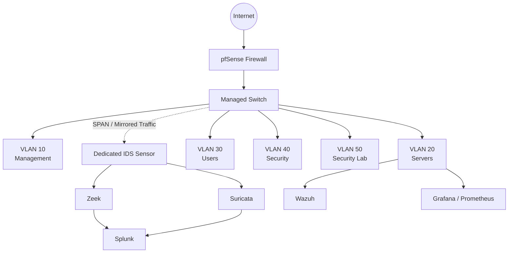

# Enterprise SOC & Network Security Lab

A hands-on enterprise-style cybersecurity home lab designed to simulate real-world Security Operations Center (SOC) workflows across network monitoring, SIEM, threat detection, incident investigation, and security engineering.

## Project Overview

This project was built to create a practical security environment where network attacks, suspicious activity, and security events could be safely generated, detected, investigated, and documented.

Rather than focusing on a single security product, the lab combines multiple defensive technologies including **pfSense, Splunk, Wazuh, Zeek, Suricata, Proxmox, Grafana, and Prometheus**.

The environment includes network segmentation, centralized logging, endpoint monitoring, network IDS/IPS capabilities, SIEM correlation, detection engineering, and controlled SOC investigations.

## Why I Built This Project

My goal was to move beyond theoretical cybersecurity knowledge and build an environment where I could practice the workflow performed by security analysts and security engineers.

The lab was designed to provide hands-on experience with:

- Security monitoring and log analysis
- SIEM investigation and event correlation
- Network traffic analysis
- IDS/IPS monitoring
- Firewall policy and VLAN segmentation
- Authentication attack investigation
- Network reconnaissance detection
- Incident documentation
- MITRE ATT&CK mapping
- Detection engineering
- Security control validation

The project also allowed me to understand how different security technologies work together rather than treating each tool as an isolated product.

## High-Level Architecture

The network is segmented using VLANs and controlled through **pfSense firewall policies**. A dedicated IDS sensor receives mirrored network traffic from the managed switch, allowing **Zeek and Suricata** to passively analyze network activity.

Security telemetry is centralized in **Splunk and Wazuh**, where events can be correlated and investigated as part of the SOC workflow.

## Security Architecture

The lab implements multiple defensive layers:

**Network Security**
- pfSense firewall
- VLAN segmentation
- Inter-VLAN access controls
- Suricata IDS/IPS

**Network Monitoring**
- Zeek network security monitoring
- Suricata network telemetry
- Managed-switch port mirroring

**Security Monitoring & SIEM**
- Splunk
- Wazuh

**Infrastructure Monitoring**
- Prometheus
- Grafana

**Virtualization**
- Proxmox VE

**Attack Simulation**
- Kali Linux

---

> **Note:** This lab is used exclusively for authorized cybersecurity testing and defensive security research within an isolated environment.
