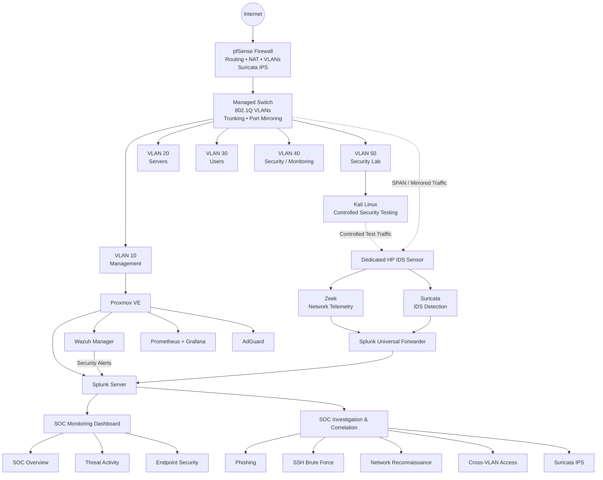
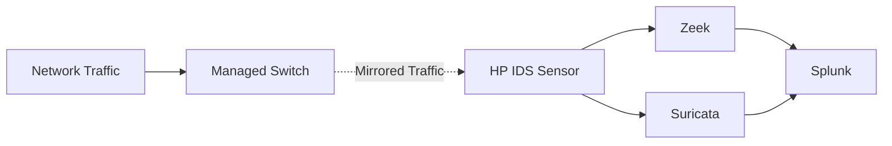
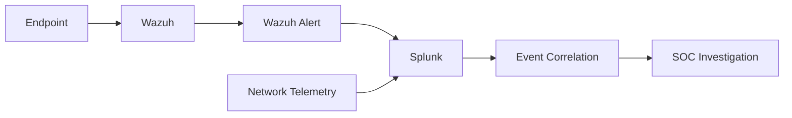

# Enterprise SOC & Network Security Lab

> A hands-on enterprise-style cybersecurity lab designed to simulate real-world Security Operations Center (SOC) workflows across network security, SIEM monitoring, threat detection, incident investigation, and detection engineering.

---

## Project Overview

This project was built to create a practical security environment where network attacks, suspicious activity, and security events could be safely generated, detected, investigated, and documented.

Rather than focusing on a single security product, the lab integrates multiple defensive technologies including:

- **pfSense**
- **Splunk**
- **Wazuh**
- **Zeek**
- **Suricata**
- **Proxmox VE**
- **Grafana**
- **Prometheus**
- **AdGuard**
- **Kali Linux**

The environment combines network segmentation, firewall enforcement, passive network monitoring, IDS/IPS, centralized logging, endpoint/security monitoring, SIEM correlation, SOC dashboards, detection engineering, and controlled security investigations.

The goal was to understand not only how individual security tools work, but how they can operate together as part of a complete defensive monitoring pipeline.

---

# Why I Built This Project

My goal was to move beyond theoretical cybersecurity knowledge and create an environment where I could practice workflows similar to those performed by SOC analysts and security engineers.

The project provided hands-on experience with:

- SIEM monitoring and log analysis
- Security event correlation
- Network traffic analysis
- IDS/IPS monitoring
- Firewall configuration
- VLAN segmentation
- Inter-VLAN security policies
- Endpoint/security monitoring
- Authentication attack investigation
- Network reconnaissance detection
- Incident triage
- MITRE ATT&CK mapping
- Detection engineering
- Security control validation
- Incident documentation

The lab also provided a controlled environment where attack simulations could be performed without targeting external systems.

---

# Project Objectives

The main objectives were to:

1. Build a segmented enterprise-style network.
2. Implement firewall policies between security zones.
3. Deploy centralized security monitoring.
4. Capture network traffic using a dedicated IDS sensor.
5. Deploy Zeek for network security telemetry.
6. Deploy Suricata for IDS/IPS monitoring.
7. Integrate Wazuh security alerts with Splunk.
8. Build SOC monitoring dashboards.
9. Generate controlled security events.
10. Investigate events using multiple telemetry sources.
11. Map relevant activity to MITRE ATT&CK.
12. Create reusable detection rules.
13. Document findings using structured SOC investigation reports.

---

# High-Level SOC Architecture



---

# Security Monitoring Pipeline

The lab follows a layered monitoring workflow:


This allows activity to move from raw network or endpoint telemetry through detection, centralized analysis, investigation, and documentation.

---

# Detailed Network Architecture

The detailed architecture was created in **draw.io / diagrams.net** to document the physical and logical components of the lab.

> **Architecture diagram will be added here**

```text
architecture/
├── enterprise-security-lab.drawio
└── enterprise-security-lab.png
```

The architecture includes:

- Internet connectivity
- pfSense firewall
- Managed switch
- VLAN segmentation
- Proxmox virtualization
- Security servers
- Dedicated IDS sensor
- Zeek
- Suricata
- Wazuh
- Splunk
- Grafana
- Prometheus
- AdGuard
- Kali Linux security-testing environment

---

# Network Segmentation

The network was divided into multiple VLANs to create security boundaries between infrastructure, servers, users, monitoring systems, and security-testing systems.

| VLAN | Purpose |
|---|---|
| VLAN 10 | Management |
| VLAN 20 | Servers |
| VLAN 30 | Users |
| VLAN 40 | Security / Monitoring |
| VLAN 50 | Security Lab |

Network segmentation reduces unnecessary communication between systems and allows firewall policies to control traffic between security zones.

This was particularly important for the Security Lab VLAN because attack simulations could be generated without giving the testing environment unrestricted access to management infrastructure.

> **VLAN configuration screenshot will be added here**

---

# pfSense Firewall

pfSense operates as the central security gateway for the lab.

Its responsibilities include:

- Network routing
- VLAN gateways
- Inter-VLAN firewall policies
- NAT
- DHCP services
- Network access control
- Security logging
- Suricata IPS integration

Firewall policies were created to control communication between VLANs.

During security investigations, pfSense logs were also forwarded to Splunk, allowing blocked connections to be investigated through the SIEM.

---

## Cross-VLAN Security

One security test attempted access from the Security Lab network toward the Management network.

The connection was blocked by pfSense according to the configured segmentation policy.

The corresponding firewall event was then identified in Splunk.

This validated the complete control path:

```text
Security Lab
      ↓
Connection Attempt
      ↓
pfSense Firewall
      ↓
BLOCK
      ↓
Firewall Log
      ↓
Splunk
      ↓
SOC Investigation
```

> 📷 **pfSense firewall evidence will be added here**

---

# Dedicated Network IDS Sensor

A dedicated HP system was configured as a passive network IDS sensor.

The managed switch mirrors network traffic to the IDS capture interface using port mirroring/SPAN.



This design allows the sensor to inspect network traffic without being directly inline with normal network communications.

---

# Zeek Network Monitoring

Zeek was deployed to provide detailed network telemetry.

Zeek was used during investigations to examine network activity such as:

- Connections
- Source and destination IP addresses
- Ports
- Protocol activity
- DNS activity
- SSH activity
- Network reconnaissance

Zeek connection telemetry was particularly useful during the network reconnaissance investigation because it provided visibility into connection attempts across multiple ports.

> **Zeek telemetry screenshot will be added here**

---

# Suricata IDS/IPS

Suricata was deployed for network threat detection and IPS testing.

The implementation was used to:

- Inspect network traffic
- Generate IDS alerts
- Test custom detection rules
- Validate inline IPS blocking
- Forward security telemetry to Splunk

A controlled IPS test was performed using a temporary Suricata rule.

The rule detected matching traffic and actively dropped the packets.

After the investigation, the temporary rule was removed and normal connectivity was verified.

> 📷 **Suricata IPS alert screenshot will be added here**

---

# Splunk SIEM

Splunk acts as the primary centralized investigation and correlation platform within the lab.

Security telemetry from multiple sources is brought into Splunk, including:

- Zeek
- Suricata
- Wazuh alerts
- pfSense firewall events
- Authentication/security events

This provides a central location for searching, correlating, and investigating security activity.

---

# SOC Monitoring Dashboard

A custom SOC dashboard was created in Splunk to provide centralized security visibility.

The dashboard includes views covering areas such as:

- SOC overview
- Threat activity
- Endpoint security
- Authentication activity
- Network security activity
- IDS/IPS events

The dashboard allows raw security telemetry to be transformed into information that can be quickly reviewed during monitoring and investigation.

> **SOC Overview dashboard screenshot will be added here**

> **Threat Activity dashboard screenshot will be added here**

> **Endpoint Security dashboard screenshot will be added here**

---

# Wazuh Integration

Wazuh was deployed as part of the endpoint and security monitoring architecture.

Wazuh security alerts were integrated with Splunk so that endpoint/security events could be correlated with network telemetry from Zeek, Suricata, and pfSense.

The resulting workflow is:



This provides broader visibility than relying on a single security data source.

---

# Infrastructure Monitoring

Prometheus and Grafana were deployed to provide infrastructure monitoring alongside the security monitoring stack.

This separates:

**Security monitoring**

from

**System/infrastructure health monitoring**

while still providing visibility into the overall lab environment.

---

# Proxmox Virtualization

Proxmox VE provides the virtualization layer for the lab.

Multiple security and infrastructure services run as separate virtual machines, allowing systems to be isolated while sharing the same physical server infrastructure.

This also makes it easier to expand, rebuild, snapshot, and test systems within the environment.

---

# Controlled Security Testing

Kali Linux was used as the controlled security-testing system.

Testing was performed only against systems within the lab environment.

Activities included:

- Authentication testing
- Port scanning
- Network reconnaissance
- Cross-VLAN access attempts
- IDS/IPS validation
- Security event generation

The purpose of these tests was not exploitation for its own sake, but to generate telemetry that could be detected and investigated using the defensive stack.

---

# SOC Investigations

Five controlled SOC investigations were completed.

| # | Investigation | Primary Security Control |
|---|---|---|
| 01 | Phishing Email Investigation | SOC Analysis |
| 02 | SSH Brute-Force Investigation | Wazuh / Splunk / Zeek |
| 03 | Network Reconnaissance | Zeek / Suricata / Splunk |
| 04 | Cross-VLAN Access Attempt | pfSense / Splunk |
| 05 | Suricata IDS/IPS Validation | Suricata / Splunk |

Each investigation includes:

- Objective
- Event generation
- Detection
- Evidence
- Investigation
- Timeline
- MITRE ATT&CK mapping where applicable
- Findings
- Impact assessment
- Verdict
- Recommendations

---

# Investigation 01 — Phishing Email

## Objective

Practice the investigation of a suspicious email using a structured SOC workflow.

## Investigation Process

The investigation focused on identifying suspicious indicators, evaluating the message, documenting evidence, and reaching an analyst verdict.

## Outcome

The investigation was documented as a structured SOC case with supporting evidence and findings.

> Detailed report: `investigations/01-phishing/`

---

# Investigation 02 — SSH Brute Force

## Objective

Generate repeated SSH authentication failures and investigate the resulting security telemetry.

## Detection Sources

- Wazuh
- Splunk
- Zeek

## Investigation

Repeated failed SSH authentication activity was generated within the controlled lab environment.

Authentication events were reviewed and correlated with network telemetry.

The investigation determined whether authentication succeeded and whether additional suspicious activity followed the attempts.

## MITRE ATT&CK

**T1110 — Brute Force**

## Outcome

The controlled activity was successfully identified and investigated.

> Detailed report: `investigations/02-ssh-brute-force/`

---

# Investigation 03 — Network Reconnaissance

## Objective

Determine whether network reconnaissance activity could be identified using network security telemetry.

## Activity

A controlled network scan was generated from the Security Lab environment.

## Detection Sources

- Zeek
- Suricata telemetry
- Splunk

## MITRE ATT&CK

**T1046 — Network Service Discovery**

## Finding

Zeek provided connection-level visibility into the scanning activity.

The investigation also demonstrated an important detection-engineering lesson: observing network telemetry is not necessarily the same as generating a dedicated security alert.

This distinction was documented as part of the findings.

> Detailed report: `investigations/03-network-reconnaissance/`

---

# Investigation 04 — Cross-VLAN Access

## Objective

Validate whether network segmentation prevents unauthorized communication between security zones.

## Activity

A controlled connection attempt was generated from the Security Lab VLAN toward the Management VLAN.

The test targeted management services including SSH and the Proxmox management interface.

## Detection Sources

- pfSense
- Splunk

## Result

pfSense blocked the connection according to the configured firewall policy.

The firewall event was then identified in Splunk.

## MITRE ATT&CK

The attempted SSH activity was documented in relation to:

**T1021.004 — SSH**

The investigation did not claim successful lateral movement because the connection was blocked.

## Outcome

The segmentation control operated as intended and prevented the unauthorized cross-VLAN connection.

> Detailed report: `investigations/04-cross-vlan-access/`

---

# Investigation 05 — Suricata IDS/IPS

## Objective

Validate Suricata's ability to detect and actively prevent traffic matching a controlled IPS rule.

## Activity

A temporary custom Suricata rule was created to match controlled ICMP traffic.

## Detection

Suricata detected the matching traffic.

## Prevention

Inline IPS functionality dropped the matching packets.

The event was also observed in Splunk.

## MITRE ATT&CK

No specific ATT&CK technique was assigned to the ICMP validation test.

The traffic was intentionally generated to validate a defensive control rather than reproduce a specific adversary technique.

## Outcome

The test successfully validated:

- Traffic inspection
- Custom rule matching
- IPS blocking
- Event logging
- SIEM correlation

The temporary test rule was removed after validation and normal connectivity was restored.

> Detailed report: `investigations/05-suricata-ips/`

---

# Detection Engineering

The project also includes custom Sigma detection rules.

Current rules include:

```text
detections/sigma/
├── ssh-bruteforce.yml
├── port-scan-detection.yml
└── suspicious-powershell.yml
```

The rules cover:

### SSH Authentication Failures

Detection of failed SSH authentication events that can be used as the event-level basis for brute-force correlation.

### Network Service Discovery

Network connection telemetry associated with potential service discovery.

A production-quality scan analytic would require correlation such as one source contacting multiple destination ports within a defined time window.

### Suspicious PowerShell

Detection of PowerShell execution containing patterns associated with suspicious or encoded command activity.

---

# MITRE ATT&CK

MITRE ATT&CK was used where the observed activity supported a meaningful mapping.

Examples include:

| Activity | ATT&CK |
|---|---|
| SSH Brute Force | T1110 — Brute Force |
| Network Reconnaissance | T1046 — Network Service Discovery |
| SSH Remote Service Attempt | T1021.004 — SSH |

ATT&CK techniques were not assigned simply to increase coverage.

Where a controlled test did not meaningfully represent a specific adversary behavior, this was documented instead of forcing an inaccurate mapping.

---

# Security Control Validation

The project validated multiple defensive controls.

### Firewall Segmentation

Unauthorized cross-VLAN access was successfully blocked.

### IDS Monitoring

Mirrored network traffic was successfully received by the dedicated IDS sensor.

### Zeek

Network connections and protocol activity were successfully recorded.

### Suricata

Network security telemetry and controlled IDS/IPS events were successfully generated.

### IPS

A controlled Suricata rule successfully dropped matching traffic.

### Wazuh

Security alerts were generated and integrated into the monitoring workflow.

### Splunk

Security events from multiple sources were searchable and could be correlated during investigations.

### SIEM Dashboard

Security telemetry was summarized through dedicated SOC monitoring views.

---

# Key Findings

Several important findings emerged from the project.

### 1. Visibility does not automatically equal detection

Zeek may provide detailed evidence that an activity occurred without generating an alert.

This demonstrated the difference between:

- telemetry
- detection logic
- alerting
- investigation

### 2. Multiple telemetry sources improve investigations

Firewall logs, Zeek connections, Suricata telemetry, Wazuh alerts, and Splunk searches each provide different perspectives.

Correlation provides stronger evidence than relying on a single source.

### 3. Network segmentation is a security control, not just network organization

The cross-VLAN investigation demonstrated that segmentation can actively prevent unauthorized access to management infrastructure.

### 4. Detection rules require context

A single connection event does not necessarily indicate a port scan.

Correlation across multiple ports, destinations, or events within a defined period is required for stronger detection logic.

### 5. Security controls should be tested

The Suricata IPS investigation demonstrated the importance of validating that a preventive control actually blocks traffic rather than assuming configuration alone proves effectiveness.

---

# Challenges & Troubleshooting

Building the lab involved troubleshooting several real infrastructure and security-monitoring issues.

Examples included:

- VLAN communication problems
- Firewall rule ordering
- DHCP/static-address configuration
- IDS capture-interface configuration
- Zeek interface monitoring
- Suricata logging
- Splunk event ingestion
- Wazuh/Splunk integration
- Service persistence after reboot
- Port-mirroring validation
- Differentiating telemetry from alerts

Troubleshooting these issues was an important part of the project because security engineering requires both deployment and validation.

---

# Post-Investigation Cleanup

Temporary security-testing rules were removed after investigations.

This included:

- Temporary SSH firewall access
- Temporary Suricata IPS rules

Connectivity and firewall behavior were then retested to confirm the environment returned to its intended security state.

This prevents test configurations from becoming permanent security exceptions.

---

# Repository Structure

```text
enterprise-soc-security-lab/
│
├── README.md
│
├── architecture/
│   ├── enterprise-security-lab.drawio
│   └── enterprise-security-lab.png
│
├── investigations/
│   ├── 01-phishing/
│   │   ├── investigation-report.md
│   │   └── evidence/
│   │
│   ├── 02-ssh-brute-force/
│   │   ├── investigation-report.md
│   │   └── evidence/
│   │
│   ├── 03-network-reconnaissance/
│   │   ├── investigation-report.md
│   │   └── evidence/
│   │
│   ├── 04-cross-vlan-access/
│   │   ├── investigation-report.md
│   │   └── evidence/
│   │
│   └── 05-suricata-ips/
│       ├── investigation-report.md
│       └── evidence/
│
├── detections/
│   ├── sigma/
│   │   ├── ssh-bruteforce.yml
│   │   ├── port-scan-detection.yml
│   │   └── suspicious-powershell.yml
│   │
│   └── splunk/
│
├── screenshots/
│   ├── dashboards/
│   ├── firewall/
│   ├── ids/
│   └── siem/
│
└── docs/
    ├── network-design.md
    ├── ids-monitoring.md
    └── findings.md
```

---

# Technology Stack

| Area | Technology |
|---|---|
| Virtualization | Proxmox VE |
| Firewall / Routing | pfSense |
| Network Segmentation | 802.1Q VLANs |
| Network IDS | Zeek |
| IDS / IPS | Suricata |
| SIEM | Splunk |
| Security Monitoring | Wazuh |
| Metrics | Prometheus |
| Visualization | Grafana |
| DNS Filtering | AdGuard |
| Security Testing | Kali Linux |
| Detection Engineering | Sigma |
| Framework | MITRE ATT&CK |
| Architecture Documentation | draw.io / diagrams.net |

---

# Skills Demonstrated

This project demonstrates practical experience with:

- SOC operations
- SIEM monitoring
- Security event correlation
- Incident investigation
- Network security monitoring
- Network traffic analysis
- Firewall administration
- VLAN segmentation
- IDS/IPS
- Zeek
- Suricata
- Splunk
- Wazuh
- pfSense
- Linux administration
- Proxmox
- Detection engineering
- Sigma
- MITRE ATT&CK
- Security documentation
- Troubleshooting

---

# Future Improvements

Potential future enhancements include:

- Additional Splunk correlation searches
- Expanded Sigma rule coverage
- Automated alert enrichment
- Threat-intelligence integration
- Additional endpoint telemetry
- Automated incident-response workflows
- Enhanced SOC dashboard visualizations
- Additional detection validation scenarios

These improvements will be added only where they provide meaningful additional security capability.

---

# What I Learned

This project provided practical experience in designing, deploying, troubleshooting, and validating a multi-layer security monitoring environment.

The most important lesson was that effective security monitoring depends on more than installing tools.

A functioning SOC workflow requires:

**Visibility → Detection → Correlation → Investigation → Validation → Documentation**

By building the environment from the network layer upward, I gained a better understanding of how network architecture, firewall policies, IDS telemetry, endpoint monitoring, SIEM correlation, detection logic, and analyst investigation work together.

---

# Ethical Use

All security testing documented in this repository was performed in an authorized lab environment against systems under my control.

The project is intended solely for cybersecurity education, defensive security research, and professional skills development.

---

# Author

**Amal Varghese**

Cyber Security | SOC | Blue Team | SIEM | Incident Response | Threat Detection | Network Security

[LinkedIn](https://www.linkedin.com/in/amalbuilds/)

---
