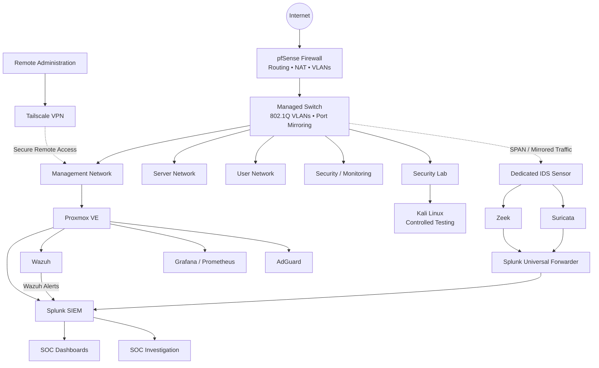
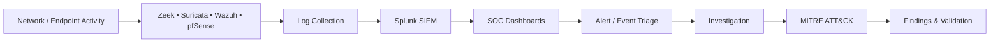
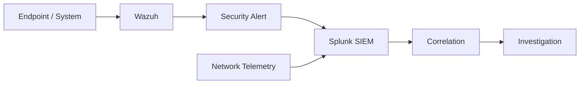

# Enterprise SOC & Network Security Lab

> A hands-on enterprise-style security lab built to demonstrate practical SOC operations, network security, SIEM monitoring, threat detection, incident investigation, and detection engineering.

---

## Objective

The objective of this project was to design and build a segmented security environment where I could safely generate security events, collect telemetry, detect suspicious activity, investigate incidents, and validate defensive controls.

Rather than working with security tools individually, I wanted to understand how multiple technologies operate together as part of a complete SOC monitoring workflow.

The lab integrates **pfSense, Splunk, Wazuh, Zeek, Suricata, Proxmox, Grafana, Prometheus, and Tailscale** to provide network security, centralized monitoring, IDS/IPS, secure remote access, infrastructure monitoring, and incident investigation capabilities.

The overall workflow is:

**Activity → Telemetry → Detection → SIEM → Dashboard → Investigation → Findings**

---

## Architecture



---

## SOC Monitoring Workflow



The architecture allows network and security activity to be collected from multiple sources and investigated centrally through Splunk.

---

## Skills Demonstrated

| Skill | Implementation |
|---|---|
| SIEM Monitoring | Splunk |
| Security Event Correlation | Splunk + multiple telemetry sources |
| Endpoint/Security Monitoring | Wazuh |
| Network Security Monitoring | Zeek |
| IDS/IPS | Suricata |
| Firewall Administration | pfSense |
| Network Segmentation | VLANs + firewall policies |
| Network Traffic Analysis | Zeek / Suricata / Wireshark |
| Incident Investigation | Structured SOC investigations |
| Detection Engineering | Sigma + SIEM detection logic |
| ATT&CK Mapping | MITRE ATT&CK |
| Virtualization | Proxmox VE |
| Secure Remote Access | Tailscale |
| Infrastructure Monitoring | Grafana + Prometheus |

---

## Tools Used

### SIEM & Security Monitoring

`Splunk` • `Wazuh`

### Network Security

`pfSense` • `Zeek` • `Suricata` • `Wireshark`

### Detection & Investigation

`Sigma` • `MITRE ATT&CK`

### Infrastructure

`Proxmox VE` • `Linux` • `Windows` • `Grafana` • `Prometheus` • `AdGuard`

### Security Testing

`Kali Linux`

### Secure Remote Access

`Tailscale`

---

# Implementation & Validation

## 1. Network Segmentation

The environment was segmented into separate network zones to reduce unnecessary communication between systems and provide controlled security boundaries.

The lab includes dedicated networks for:

- Management
- Servers
- Users
- Security / Monitoring
- Security Testing

Inter-network communication is routed through **pfSense**, where firewall policies determine which traffic is permitted or denied.

### Why I Implemented It

A flat network would allow systems to communicate with little restriction. Segmentation provides an opportunity to apply least-privilege network-access policies and test whether security boundaries actually prevent unauthorized communication.

### Validation

I generated a controlled cross-network connection attempt and verified that pfSense blocked access according to the configured policy.

# Network Security Screenshots

---

## 2. pfSense Firewall

pfSense acts as the central firewall and routing platform for the lab.

It provides:

- Routing
- Network gateways
- Firewall policies
- NAT
- DHCP
- Inter-network access control
- Security logging

Firewall events are also used during security investigations.

### Validation

Firewall policy effectiveness was tested rather than assumed.

During the cross-network investigation, a controlled connection attempt toward management infrastructure was blocked by pfSense and the resulting event was investigated in Splunk.

> **Evidence:** pfSense firewall-rule and blocked-event screenshots will be added here.

---

## 3. Secure Remote Access

**Tailscale VPN** was implemented to provide encrypted remote access to authorized lab systems without unnecessarily exposing internal management services directly to the public Internet.

### Security Purpose

This provides a controlled remote-administration path while reducing exposure of management interfaces.

> **Evidence:** Sanitized VPN configuration/connection screenshot will be added here.

Detailed implementation: [`docs/secure-remote-access.md`](docs/secure-remote-access.md)

---

## 4. Dedicated IDS Sensor

A dedicated system was configured as a passive network IDS sensor.

The managed switch uses **port mirroring/SPAN** to provide the sensor with copies of network traffic.

The sensor runs:

- Zeek
- Suricata
- Splunk Universal Forwarder
- Wazuh Agent

### Why a Dedicated Sensor?

Separating network monitoring from normal endpoints provides a dedicated location for passive traffic inspection.

### Validation

Packet capture was used to verify that mirrored traffic was successfully reaching the monitoring interface.

> **Evidence:** IDS interface / packet-capture screenshot will be added here.

Detailed implementation: [`docs/ids-monitoring.md`](docs/ids-monitoring.md)

---

## 5. Zeek Network Security Monitoring

Zeek provides detailed network telemetry that can be used during investigations.

Telemetry includes information such as:

- Network connections
- Source and destination addresses
- Ports
- Protocol activity
- DNS activity
- SSH activity

Zeek was particularly useful during the network-reconnaissance investigation because it provided connection-level evidence of scanning activity.

### Key Finding

**Visibility is not the same as detection.**

Zeek can provide evidence that suspicious network activity occurred even when no dedicated alert is generated.

This became an important detection-engineering finding during the project.

> **Evidence:** Zeek connection telemetry screenshot will be added here.

---

## 6. Suricata IDS/IPS

Suricata provides network IDS/IPS capability.

It was used for:

- Network inspection
- IDS alerts
- Custom-rule testing
- IPS validation
- Security-event logging

### IPS Validation

A temporary controlled Suricata rule was created to match specific test traffic.

The test confirmed that:

1. Traffic reached Suricata.
2. The rule matched.
3. Suricata generated the security event.
4. Inline IPS dropped the matching traffic.
5. The resulting event was visible in Splunk.

The temporary rule was removed after validation and normal connectivity was retested.

> **Evidence:** Suricata detection and Splunk-event screenshots will be added here.

---

## 7. Wazuh Security Monitoring

Wazuh provides security monitoring within the environment.

A major part of the project was integrating **Wazuh alerts into Splunk**, allowing Wazuh security events to be investigated alongside network telemetry.



### Why Integrate Wazuh with Splunk?

Individual security products provide only part of an investigation.

Centralizing telemetry allows endpoint/security events to be compared with network activity and other security logs.

> **Evidence:** Wazuh alerts visible inside Splunk will be added here.

Detailed integration: [`docs/wazuh-integration.md`](docs/wazuh-integration.md)

---

## 8. Splunk SIEM

Splunk acts as the primary centralized investigation and correlation platform.

Security information from multiple sources can be searched and analyzed from one location, including:

- Wazuh alerts
- Zeek telemetry
- Suricata events
- pfSense firewall events
- Authentication/security events

Splunk was used throughout the project for:

- Event searching
- Log analysis
- Event correlation
- Investigation
- Dashboard visualization
- Security-control validation

> **Evidence:** Splunk data-source/search screenshot will be added here.

Detailed implementation: [`docs/splunk-siem.md`](docs/splunk-siem.md)

---

# SOC Dashboards

Custom Splunk dashboards were created to provide centralized visibility into security activity.

## SOC Overview

Provides a high-level view of important security activity across the environment.

> **Dashboard Screenshot — SOC Overview**

## Threat Activity

Provides visibility into detected or suspicious security activity.

> **Dashboard Screenshot — Threat Activity**

## Endpoint Security

Provides visibility into endpoint/security monitoring information.

> **Dashboard Screenshot — Endpoint Security**

The dashboards demonstrate the transformation of raw telemetry into information that can be reviewed more efficiently during SOC monitoring.

---

# SOC Investigations

The lab was used to perform structured security investigations rather than only generate alerts.

| # | Investigation | Primary Evidence |
|---|---|---|
| 01 | Phishing Email | Email/indicator analysis |
| 02 | SSH Brute Force | Wazuh / Splunk / Zeek |
| 03 | Network Reconnaissance | Zeek / Suricata / Splunk |
| 04 | Cross-Network Access Attempt | pfSense / Splunk |
| 05 | Suricata IDS/IPS Validation | Suricata / Splunk |

---

## 01 — Phishing Investigation

A suspicious email was investigated using a structured SOC workflow.

The case focused on analyzing available indicators, documenting evidence, assessing the activity, and producing an analyst finding.

[View Investigation](investigations/01-phishing/)

---

## 02 — SSH Brute-Force Investigation

Controlled repeated SSH authentication failures were generated inside the lab.

Security and network telemetry was reviewed to identify the authentication activity and determine whether access succeeded or additional suspicious activity followed.

**MITRE ATT&CK:** `T1110 — Brute Force`

[View Investigation](investigations/02-ssh-brute-force/)

---

## 03 — Network Reconnaissance

Controlled network reconnaissance was generated from the security-testing environment.

Zeek provided connection-level evidence showing communication across multiple network services.

The investigation demonstrated an important distinction between **telemetry collection** and **dedicated detection logic**.

**MITRE ATT&CK:** `T1046 — Network Service Discovery`

[View Investigation](investigations/03-network-reconnaissance/)

---

## 04 — Cross-Network Access Attempt

A controlled connection attempt was generated from the security-testing environment toward management infrastructure.

pfSense blocked the connection according to the configured security policy.

The firewall event was then identified in Splunk.

For the attempted SSH remote-service activity:

**MITRE ATT&CK:** `T1021.004 — SSH`

The investigation does not claim successful lateral movement because the firewall prevented the connection.

[View Investigation](investigations/04-cross-vlan-access/)

---

## 05 — Suricata IDS/IPS Validation

A temporary controlled Suricata rule was used to validate inline prevention.

The test confirmed:

**Traffic → Detection → Rule Match → Packet Drop → Logging → Splunk Visibility**

No ATT&CK technique was assigned because the test was designed to validate a defensive control rather than reproduce a specific adversary technique.

[View Investigation](investigations/05-suricata-ips/)

---

# Detection Engineering

The project includes custom Sigma detection content.

```text
detections/
└── sigma/
    ├── ssh-bruteforce.yml
    ├── port-scan-detection.yml
    └── suspicious-powershell.yml
```

### SSH Authentication Detection

Detects failed SSH authentication activity that can be used as an event-level building block for brute-force correlation.

### Network Service Discovery Detection

Identifies network telemetry associated with potential service discovery.

A stronger port-scan analytic requires correlation across multiple destination ports or events within a defined period.

### Suspicious PowerShell Detection

Identifies PowerShell execution containing patterns associated with suspicious command activity.

[View Detection Rules](detections/)

---

# MITRE ATT&CK Mapping

MITRE ATT&CK was applied only where the observed activity supported an appropriate mapping.

| Activity | Technique |
|---|---|
| SSH Brute Force | `T1110 — Brute Force` |
| Network Service Discovery | `T1046 — Network Service Discovery` |
| SSH Remote-Service Attempt | `T1021.004 — SSH` |

ATT&CK techniques were not assigned to tests that did not meaningfully represent adversary behavior.

---

# Key Findings

### 1. Visibility Does Not Equal Detection

Collecting telemetry does not automatically create a useful security alert.

Detection logic and correlation are required to transform raw events into actionable detections.

### 2. Correlation Improves Investigations

Wazuh, Zeek, Suricata, pfSense, and Splunk provide different perspectives.

Combining these sources provides stronger investigative context than relying on a single tool.

### 3. Segmentation Is an Active Security Control

The controlled cross-network test demonstrated that firewall-enforced segmentation can prevent unauthorized access to management infrastructure.

### 4. Detection Rules Require Context

A single network connection is not sufficient to confidently identify a port scan.

Useful detections often require correlation across multiple events, ports, destinations, or time windows.

### 5. Security Controls Must Be Validated

Configuring an IDS/IPS does not prove that prevention works.

The Suricata test validated the complete path from traffic inspection to active blocking and SIEM visibility.

---

# Challenges & Troubleshooting

Building the environment required troubleshooting across several areas, including:

- VLAN connectivity
- Firewall rules
- DHCP/static addressing
- Port mirroring
- IDS capture interfaces
- Zeek monitoring
- Suricata logging
- Splunk ingestion
- Wazuh/Splunk integration
- Service persistence
- Detection versus telemetry behavior

Troubleshooting was an important part of the project because deploying a security control is only useful when its operation can be verified.

---

# Security Validation & Cleanup

Temporary configurations used during controlled security testing were removed after the investigations.

This included temporary firewall access and temporary Suricata test rules.

The environment was then retested to confirm that:

- Intended firewall restrictions were restored
- Normal network connectivity operated correctly
- IDS monitoring remained operational
- Mirrored traffic continued reaching the sensor

This prevented temporary testing configurations from becoming permanent security exceptions.

---

# Repository Structure

```text
enterprise-soc-security-lab/
│
├── README.md
├── architecture/
├── docs/
├── investigations/
├── detections/
└── screenshots/
```

Detailed implementation documentation is stored under `docs/`, full SOC cases under `investigations/`, and detection content under `detections/`.

---

# What I Learned

This project strengthened my understanding of how individual defensive technologies operate as part of a larger security architecture.

The most important lesson was that effective SOC monitoring is not simply about installing security tools.

A useful defensive workflow requires:

**Visibility → Detection → Correlation → Investigation → Validation → Documentation**

Building the environment from the network layer through to SIEM investigation helped me understand how firewall policies, network telemetry, IDS/IPS, security monitoring, detection logic, dashboards, and analyst investigation work together.

---

# Ethical Use

All security testing documented in this repository was performed in an authorized lab environment against systems under my control.

The project is intended solely for cybersecurity education, defensive-security research, and professional skills development.

---

# Author

**Amal Varghese**

Cyber Security | SOC | Blue Team | Security Engineering

[LinkedIn](https://www.linkedin.com/in/amalbuilds/)

[Back to CyberAmal Portfolio](https://github.com/CyberAmal)
