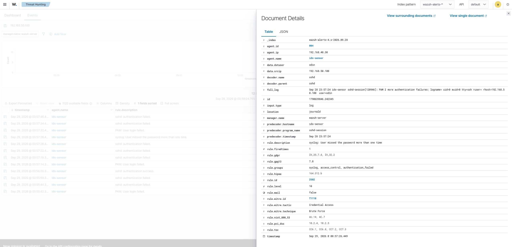
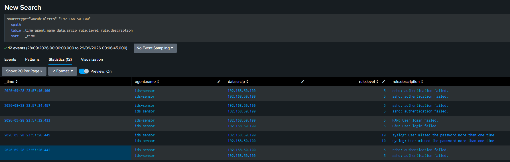
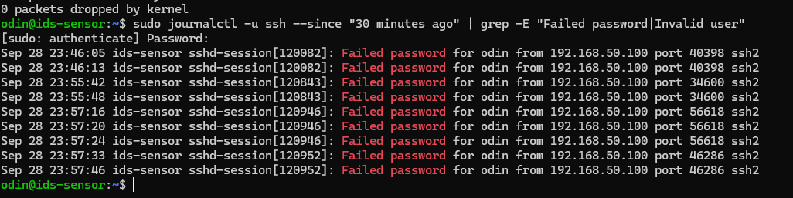

# SSH Brute-Force Investigation

## Overview

A controlled SSH brute-force simulation was performed within the lab to investigate repeated authentication failures using multiple security data sources.

The objective was to determine whether the activity could be detected, validate the underlying host evidence, correlate the events in Splunk, and determine whether authentication was successful.

**Final Verdict:** True Positive — Controlled SSH Brute-Force Simulation  
**Impact:** No evidence of successful unauthorized authentication or system compromise  
**MITRE ATT&CK:** `T1110 — Brute Force`

---

## 1. Wazuh Detection

Wazuh detected repeated SSH authentication failures on the monitored system and generated security alerts associated with the activity.

The alert provided the initial detection evidence and identified repeated authentication failures requiring investigation.

---

## 2. Splunk Correlation

The SSH security events were investigated in Splunk to correlate the authentication activity from a centralized SIEM.

Splunk provided centralized visibility into the events and allowed the activity to be compared with other available security telemetry.

---

## 3. Linux Authentication Log Validation

The underlying Linux authentication logs were reviewed to validate the security alerts against the original host evidence.

The logs contained failed SSH authentication activity, including failed-password and invalid-user events associated with the controlled test.

This provided host-level evidence supporting the Wazuh and Splunk findings.

---

## 4. Incident Timeline

The relevant events were organized chronologically to understand the sequence of authentication activity during the investigation.

The timeline helped correlate the authentication failures across the available security data sources.

---

## 5. MITRE ATT&CK Mapping

The observed repeated authentication attempts were mapped to the MITRE ATT&CK framework.

**T1110 — Brute Force**

The mapping reflects the repeated authentication attempts observed during the controlled SSH brute-force simulation.

---

## Analyst Assessment

The investigation confirmed that the observed activity represented a **true-positive SSH brute-force detection generated as part of a controlled security test**.

Wazuh identified the authentication failures, the underlying Linux logs confirmed the failed SSH attempts, and Splunk provided centralized visibility for correlation and investigation.

No evidence of successful unauthorized authentication or subsequent compromise was identified during the investigation.

### Verdict

**True Positive — Controlled SSH Brute-Force Simulation**

### Impact

**No successful unauthorized authentication or system compromise identified.**

### Recommended Actions

In a production environment, repeated SSH authentication failures should prompt:

- Investigation of the source of the authentication attempts
- Review for successful logins following repeated failures
- Blocking or restricting malicious source addresses where appropriate
- Use of key-based SSH authentication
- Restriction of SSH access to authorized management networks
- Continued monitoring for additional suspicious authentication activity

---

## SOC Skills Demonstrated

- SSH authentication investigation
- Wazuh alert analysis
- Linux authentication-log analysis
- Splunk SIEM investigation
- Multi-source event correlation
- Incident triage
- Timeline analysis
- MITRE ATT&CK mapping
- Evidence-based analyst assessment

## Investigation Workflow

**SSH Authentication Failures → Wazuh Detection → Linux Log Validation → Splunk Correlation → Timeline Analysis → MITRE ATT&CK Mapping → Analyst Verdict**
