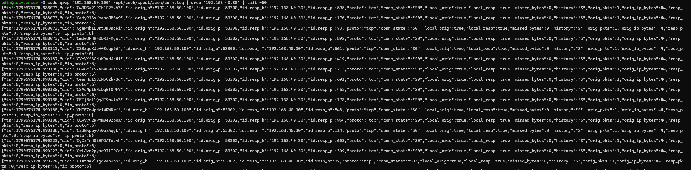
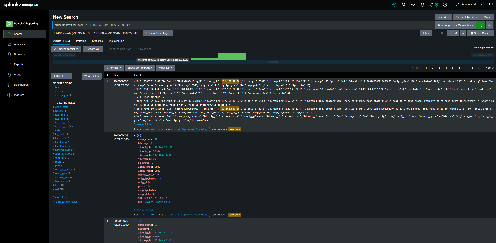
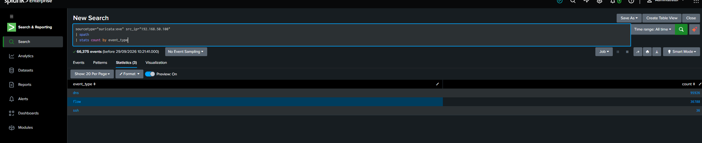
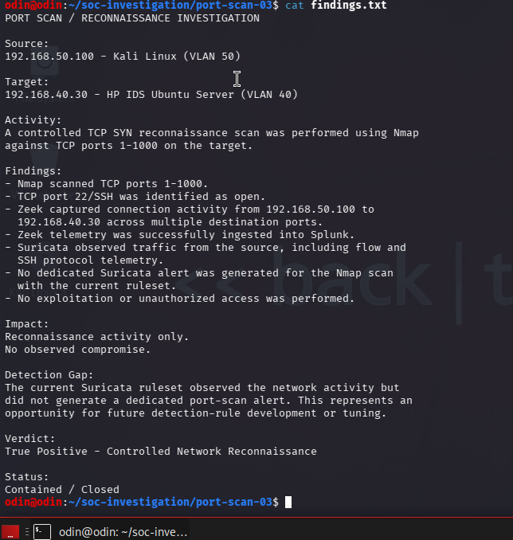
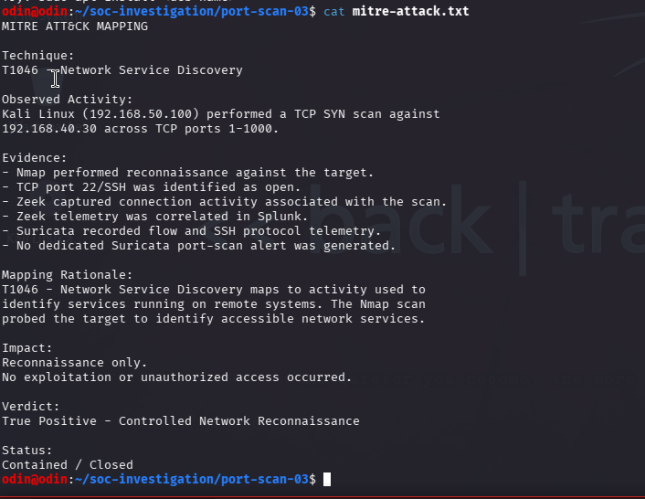

# Network Reconnaissance Investigation

## Overview

A controlled network reconnaissance test was performed within the lab to investigate how scanning activity appears across network-monitoring and SIEM telemetry.

The activity originated from the security-testing environment and targeted an authorized internal lab system across multiple network services.

The objective was to determine whether the reconnaissance activity could be identified through network telemetry, correlated in Splunk, and distinguished from a dedicated security detection.

**Final Verdict:** True Positive — Controlled Network Reconnaissance  
**MITRE ATT&CK:** `T1046 — Network Service Discovery`

---

## 1. Zeek Network Evidence

Zeek connection telemetry was reviewed following the controlled network scan.

The telemetry showed repeated TCP connection attempts from the same source toward the same destination across multiple destination ports.

This provided network-level evidence that reconnaissance activity had occurred.

---

## 2. Splunk Correlation

Zeek telemetry associated with the reconnaissance activity was investigated centrally in Splunk.

Splunk allowed the source, destination, ports, and associated connection activity to be searched and reviewed from the centralized SIEM.

This demonstrated how raw network telemetry could be used during a SOC investigation even without a dedicated port-scan alert.

---

## 3. Suricata Network Telemetry

Suricata telemetry was reviewed to provide additional network visibility during the investigation.

The available telemetry was compared with the Zeek and Splunk evidence to provide additional context around the observed network activity.

---

## 4. Investigation Findings

Evidence collected from the monitoring environment was correlated to determine the nature of the activity.

The investigation identified repeated connection attempts across multiple network services originating from the controlled security-testing environment.

### Key Finding

**Visibility is not the same as detection.**

Zeek provided detailed connection-level evidence of the reconnaissance activity. However, the presence of network telemetry alone did not constitute a dedicated port-scan detection.

This demonstrated the importance of combining **telemetry collection, detection logic, SIEM correlation, and analyst investigation**.

---

## 5. MITRE ATT&CK Mapping

The observed reconnaissance behavior was mapped to the MITRE ATT&CK framework.

**T1046 — Network Service Discovery**

The mapping reflects the controlled discovery of network services across multiple destination ports during the investigation.

---

## Analyst Assessment

The investigation confirmed that the observed activity represented **controlled network reconnaissance performed within the lab environment**.

Zeek provided connection-level visibility into the scanning activity, while Splunk enabled centralized searching and correlation of the associated telemetry. Suricata provided additional network telemetry for comparison.

The investigation demonstrated that security telemetry can provide strong evidence of suspicious behavior even when a dedicated detection alert is not generated.

### Verdict

**True Positive — Controlled Network Reconnaissance**

### Impact

The activity was generated as part of an authorized lab test. No evidence of unauthorized compromise was identified.

### Recommended Actions

In a production environment, similar reconnaissance activity should prompt:

- Investigation of the source system
- Review of the destination ports and services being probed
- Correlation with firewall, IDS, endpoint, and authentication telemetry
- Review for subsequent exploitation or authentication attempts
- Restriction of unnecessary network services
- Development or tuning of detection logic for repeated multi-port connection attempts

---

## SOC Skills Demonstrated

- Network reconnaissance investigation
- Zeek connection-log analysis
- Suricata network telemetry analysis
- Splunk SIEM investigation
- Port and protocol analysis
- Multi-source telemetry correlation
- Detection-gap identification
- MITRE ATT&CK mapping
- Evidence-based analyst assessment

## Investigation Workflow

**Controlled Reconnaissance → Zeek Telemetry → Splunk Correlation → Suricata Telemetry → Analyst Findings → MITRE ATT&CK Mapping**
