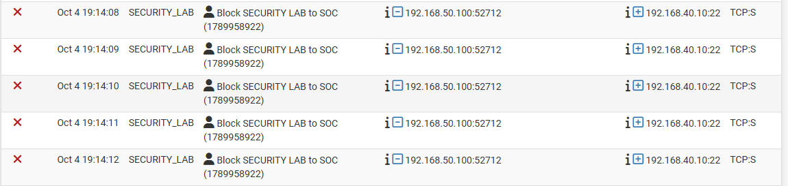
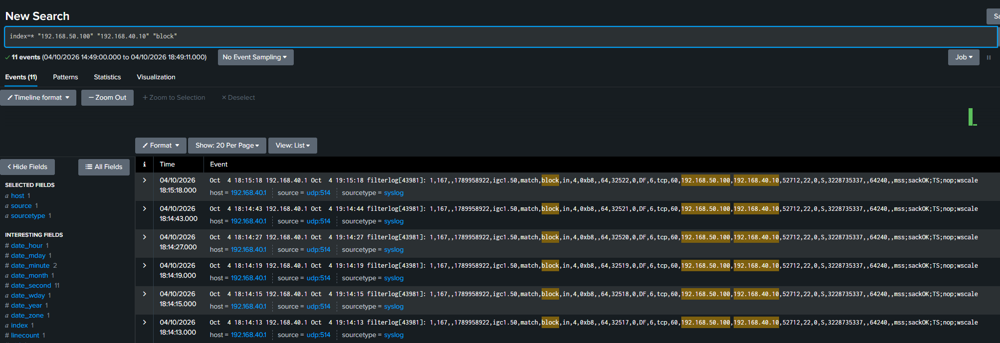
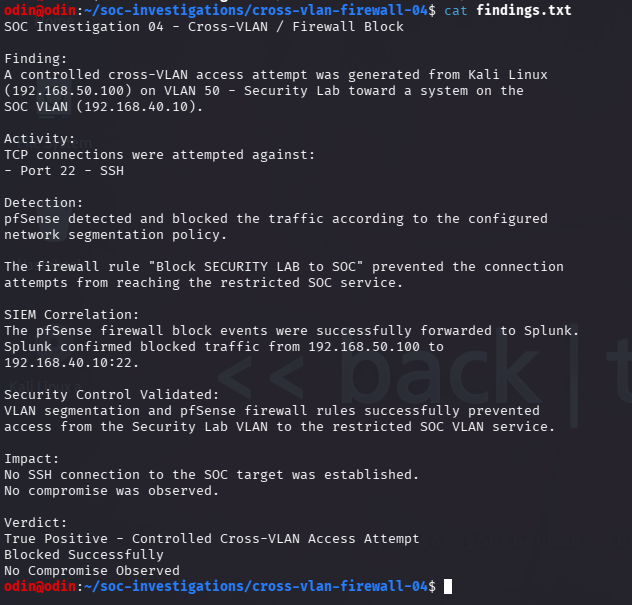

# Cross-VLAN Firewall Block Investigation

## Overview

A controlled cross-VLAN access attempt was performed to validate network segmentation between the **Security Lab VLAN** and the **SOC VLAN**.

Kali Linux on the Security Lab VLAN attempted to establish an SSH connection to a system within the SOC VLAN.

The objective was to determine whether the configured pfSense firewall policy would prevent unauthorized cross-VLAN access and whether the resulting security event could be investigated through Splunk.

**Final Verdict:** True Positive — Controlled Cross-VLAN Access Attempt  
**Result:** Blocked Successfully  
**Impact:** No compromise observed

---

## 1. pfSense Firewall Detection

A controlled SSH connection attempt was generated from:

- **Source:** `192.168.50.100` — Security Lab VLAN
- **Destination:** `192.168.40.10` — SOC VLAN
- **Service:** SSH
- **Destination Port:** TCP/22

pfSense identified the cross-VLAN traffic and applied the configured firewall rule:

**`Block SECURITY LAB to SOC`**

The firewall logs showed repeated TCP connection attempts being blocked before access to the restricted SOC service could be established.

---

## 2. Splunk SIEM Correlation

The corresponding pfSense firewall events were forwarded to Splunk for centralized investigation.

Splunk confirmed the blocked communication between the Security Lab source and the SOC target, demonstrating that firewall enforcement events were available for centralized SOC investigation.

---

## 3. Investigation Findings

The collected firewall and SIEM evidence was reviewed to determine whether the segmentation policy operated as intended.

The investigation confirmed that the configured inter-VLAN firewall policy successfully prevented the Security Lab system from establishing an SSH connection to the restricted SOC system.

---

## Analyst Assessment

The observed activity was generated as part of an authorized security-control validation test.

pfSense successfully identified and blocked the cross-VLAN connection attempts according to the configured segmentation policy. The resulting firewall events were also available in Splunk for centralized investigation.

### Verdict

**True Positive — Controlled Cross-VLAN Access Attempt**

### Security Control Result

**Blocked Successfully**

### Impact

No SSH connection to the SOC target was established during the controlled test.

**No compromise was observed.**

---

## Security Controls Validated

- VLAN network segmentation
- Inter-VLAN firewall policy enforcement
- pfSense firewall logging
- Centralized firewall-log ingestion
- Splunk SIEM investigation

## SOC Skills Demonstrated

- Firewall-log analysis
- Network segmentation validation
- Cross-VLAN traffic investigation
- Splunk SIEM investigation
- Multi-source evidence correlation
- Security-control validation
- Analyst documentation

## Investigation Workflow

**Security Lab VLAN → Cross-VLAN SSH Attempt → pfSense Firewall Block → Splunk SIEM Correlation → Analyst Finding**
