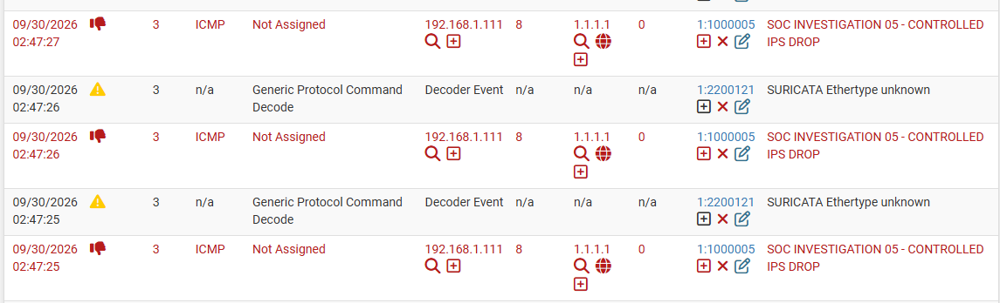
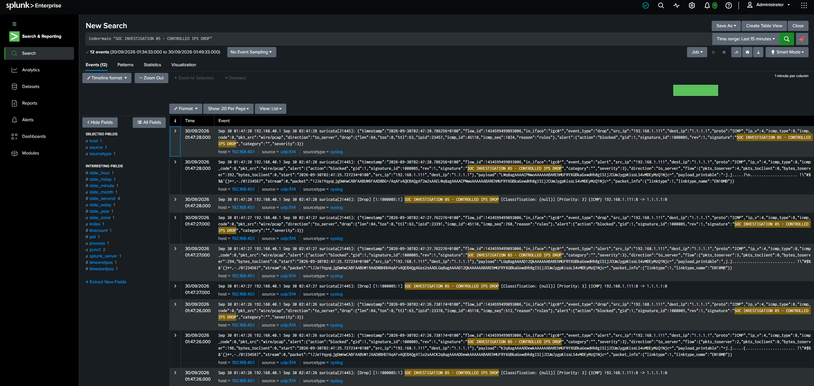
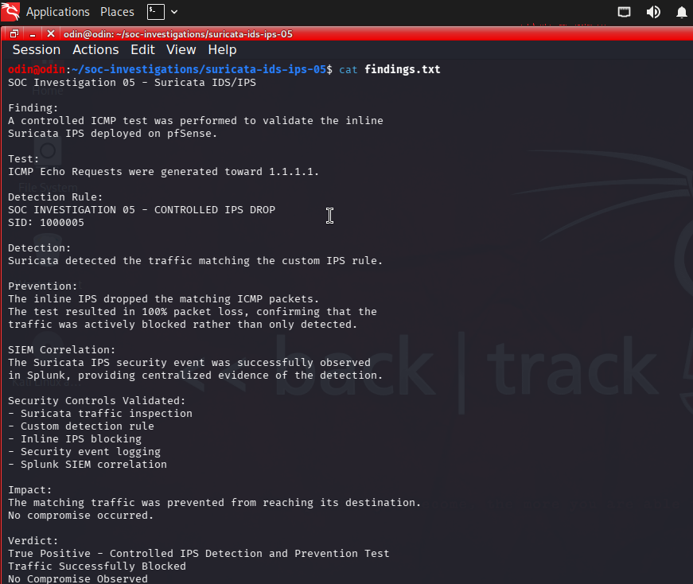
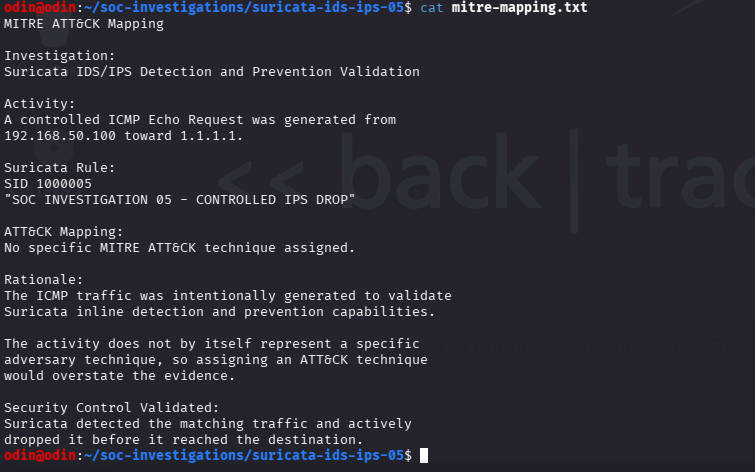

# Suricata IDS/IPS Validation

## Overview

A controlled ICMP test was performed to validate the inline prevention capability of Suricata IPS within the lab environment.

A temporary custom Suricata rule was configured to match the controlled traffic and actively block matching packets.

The objective was to validate the complete prevention and monitoring pipeline:

**Controlled Traffic → Suricata Inspection → Rule Match → Packet Drop → Security Event → Splunk SIEM**

**Final Verdict:** True Positive — Controlled IPS Detection and Prevention Test  
**Result:** Traffic Successfully Blocked  
**Impact:** No compromise observed  
**Rule SID:** `1000005`

---

## 1. Suricata IPS Detection and Drop

Controlled ICMP Echo Request traffic was generated toward an external destination.

The custom Suricata IPS rule matched the traffic and generated the alert:

**`SOC INVESTIGATION 05 - CONTROLLED IPS DROP`**

The Suricata event confirmed that the matching traffic triggered the configured IPS rule and was handled as a drop/block action.

---

## 2. Splunk SIEM Correlation

The resulting Suricata IPS security events were forwarded to Splunk for centralized investigation.

The corresponding events in Splunk contained the custom signature and SID `1000005`.

The event data also recorded the Suricata event as a **drop** with the alert action marked as **blocked**, providing centralized evidence of the IPS enforcement.

---

## 3. Investigation Findings

The collected evidence was reviewed to determine whether Suricata successfully detected and prevented the controlled traffic.

The test demonstrated that:

- Controlled ICMP traffic reached Suricata.
- The custom IPS rule matched the traffic.
- Suricata generated the expected security event.
- The matching traffic was actively dropped.
- The test resulted in packet loss during the controlled validation.
- The resulting IPS events were visible in Splunk.

### Security Controls Validated

- Suricata traffic inspection
- Custom IPS rule
- Inline traffic blocking
- Security-event logging
- Splunk SIEM correlation

---

## 4. MITRE ATT&CK Assessment

The activity was reviewed to determine whether a MITRE ATT&CK technique should be assigned.

**No specific MITRE ATT&CK technique was assigned.**

The ICMP traffic was intentionally generated to validate Suricata inline detection and prevention capabilities. The test did not represent a specific adversary behavior, and assigning an ATT&CK technique would overstate the evidence.

---

## Analyst Assessment

The investigation confirmed that Suricata successfully detected traffic matching the controlled IPS rule and actively blocked the matching packets.

The resulting security events were also successfully ingested into Splunk, providing centralized evidence of both the detection and prevention activity.

### Verdict

**True Positive — Controlled IPS Detection and Prevention Test**

### Result

**Traffic Successfully Blocked**

### Impact

The matching traffic was prevented from reaching its destination during the controlled test.

**No compromise was observed.**

---

## SOC Skills Demonstrated

- Suricata IDS/IPS administration
- Custom IPS rule testing
- Inline prevention validation
- Network-security event analysis
- Splunk SIEM investigation
- Security-event correlation
- Security-control validation
- Evidence-based analyst assessment
- MITRE ATT&CK applicability assessment

## Investigation Workflow

**Controlled ICMP Traffic → Suricata Inspection → Custom Rule Match → Inline Packet Drop → Security Event → Splunk SIEM → Analyst Validation**
